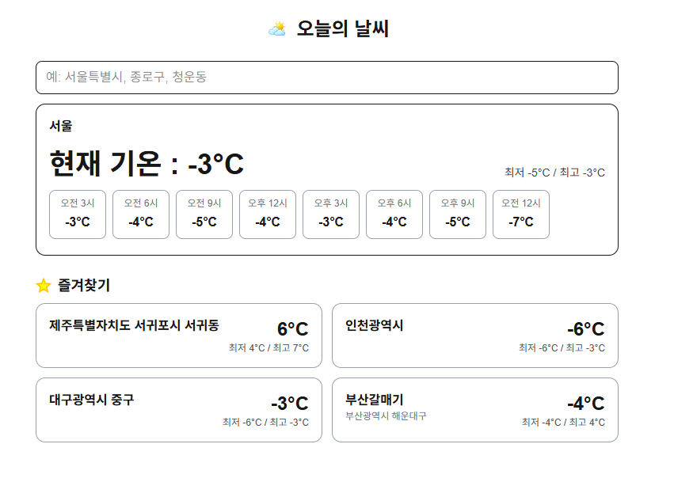

# 🌤️ Weather Assignment

현재 위치 및 검색한 지역의 날씨를 확인하고, 자주 보는 장소를 즐겨찾기로 관리할 수 있는 날씨 웹 애플리케이션입니다.

---

## 1. 프로젝트 실행 방법

```bash
# 레포지토리 클론
git clone https://github.com/pcw7/weather-assignment.git

# 패키지 설치
npm install

# 환경변수 설정 (.env 생성)
NEXT_PUBLIC_OPENWEATHER_KEY=YOUR_API_KEY

# 개발 서버 실행
npm run dev
```

## 2. 구현한 기능

📍 현재 위치 날씨

* 브라우저 Geolocation API를 이용해 사용자의 현재 위치를 가져옵니다.
* 현재 기온, 오늘 최저/최고 기온, 시간대별 예보를 확인할 수 있습니다.

🔍 지역 검색

* 행정구역 데이터를 기반으로 지역명을 검색할 수 있습니다.
* 검색 결과를 선택하면 해당 지역의 날씨 정보가 표시됩니다.
* 즐겨찾기한 장소도 검색 대상에 포함됩니다.

⭐ 즐겨찾기

* 장소를 즐겨찾기에 추가/삭제할 수 있습니다.
* 즐겨찾기는 LocalStorage에 저장되어 새로고침 후에도 유지됩니다.
* 즐겨찾기는 최대 6개까지 등록 가능합니다.
* 별칭을 설정할 수 있습니다.
* 즐겨찾기 카드에서 바로 날씨 요약을 확인할 수 있습니다.

🕒 시간별 날씨

* 3시간 간격으로 24시간의 예보를 표시합니다.
* 오전/오후 형식의 한국식 시간 포맷을 적용했습니다.
* 카드 UI로 가독성을 높였습니다.

## 3. 기술적 의사결정 및 이유

Next.js

* 빠른 개발과 배포가 가능하고 Vercel과의 연동이 매우 편리합니다.
* Client Component를 통해 브라우저 API(Geolocation)를 자연스럽게 사용할 수 있습니다.

TanStack Query

* API 호출 상태(loading, error, success)를 간단하게 관리할 수 있습니다.
* 동일한 좌표 요청 시 캐싱으로 불필요한 네트워크 요청을 줄일 수 있습니다.
* 날씨처럼 읽기 위주의 데이터 처리에 적합합니다.

Context API + LocalStorage

* 즐겨찾기 상태를 전역으로 관리하기 위해 Context API를 사용했습니다.
* 서버 없이도 상태를 유지하기 위해 LocalStorage를 사용했습니다.
* 구조가 단순하고 유지보수가 쉽습니다.

OpenWeather API

* 무료로도 충분한 기능을 제공합니다.
* 현재 날씨와 5일/3시간 예보 데이터를 모두 제공합니다.

Tailwind CSS

* 빠른 스타일링이 가능합니다.
* 컴포넌트 단위로 스타일 관리가 쉽습니다.
* 일관된 UI 구성에 적합합니다.

## 4.기술스택

<table>
  <thead>
    <tr>
      <th>🎨 프론트엔드</th>      
      <th>🔌 기타</th>
    </tr>
  </thead>
  <tbody>
    <tr>
      <td align="center">
        
        <br/>
        
        <br/>
                
      </td>    
      <td align="center">        
        
        <br/>
        
      </td>
    </tr>
  </tbody>
</table>